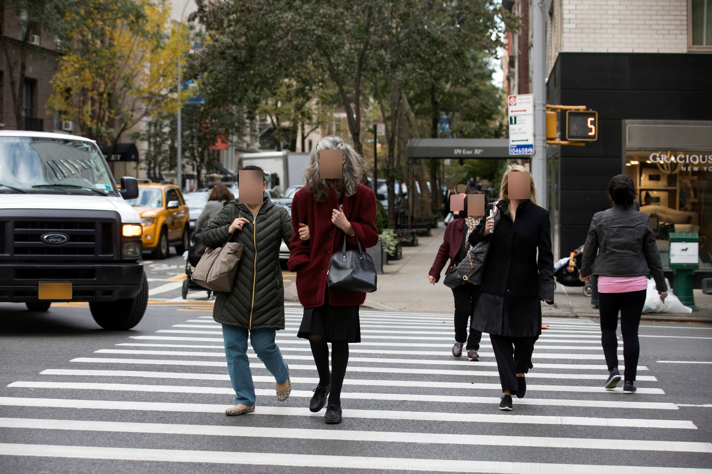
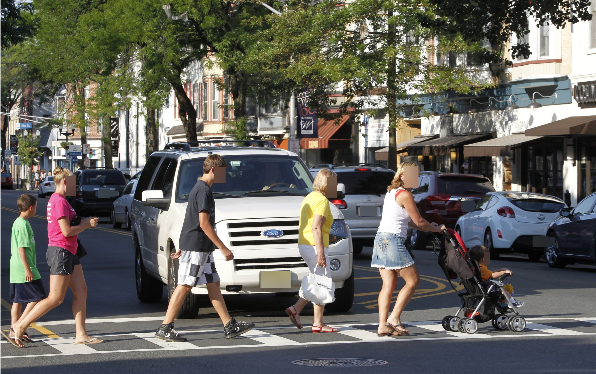

# Python Notebook Tools for Anonymizing Face and License Plate

This Python notebook provides tools and techniques for anonymizing sensitive information such as faces and license plates within image datasets. It aims to assist users in preserving privacy while working with image data containing identifiable features.

<a href="https://github.com/rakiiibul/LF_Anonymization/issues">Report Bug</a> · <a href="https://github.com/rakiiibul/LF_Anonymization/issues">Request Feature</a>

## Features

-   Anonymization of Faces: Utilize facial detection and blurring techniques to anonymize faces detected within images.
-   License Plate Anonymization: Apply object detection algorithms to identify and anonymize license plates present in images.
-   Customization Options: Configure parameters for anonymization, including blur intensity, detection thresholds, and output formats.
-   Compatibility: Compatible with common image formats such as JPEG, PNG, JPG and BMP.

## Requirements

-   Python 3.x
-   Jupyter Notebook or JupyterLab
-   OpenCV library for image processing
-   Face detection and recognition libraries YOLO
-   License plate recognition libraries YOLO model

## Installation

1.  Clone the repository to your local machine:

       git clone https://github.com/rakiiibul/LF_Anonymization.git
    
3.  Launch Jupyter Notebook or JupyterLab and open the anonymization notebook file (`anonymization.ipynb`).

## Example

1.  Original images

 </a> 
  </a>
 

2.  Anonymized Images

    </a>
    </a>

## Usage

1.  Load your image dataset into the notebook environment.
2.  Follow the instructions provided in the notebook to execute the anonymization tools for faces and license plates.
3.  Adjust parameters and thresholds as needed to optimize the anonymization process.
4.  Review the anonymized images and ensure that sensitive information is adequately obscured.
5.  Export the anonymized dataset for further analysis or distribution.

## Disclaimer

-   This tool is intended for research and educational purposes only.
-   Users are responsible for ensuring compliance with privacy regulations and obtaining appropriate consent for anonymizing and sharing image data.
-   The effectiveness of anonymization techniques may vary depending on image quality, resolution, and other factors.
-   The images are downloaded from open source website.
1. <https://ar.inspiredpencil.com/pictures-2023/pedestrian-crossing-street>
2. <https://www.nj.com/news/2012/07/2010_law_to_reduce_pedestrian.html>

## Contributing

-   Contributions, bug reports, and feature requests are welcome. Please submit a pull request or open an issue on GitHub to contribute to the project.

## License

This project is licensed under the MIT License. See the [LICENSE](LICENSE) file for details.

------------------------------------------------------------------------

Feel free to customize this README file according to your specific project requirements and guidelines.
